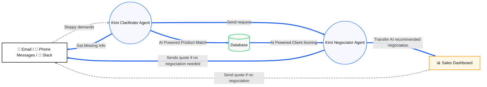

# 🚀 StationW – Intelligent Order Processing Platform

**Powered by Kimi** | Open-source hackaton project for GOSIM 2026

## Overview

StationW is an **AI-driven order processing and negotiation platform** that transforms how businesses handle customer orders. It solves the critical problem of **rapid order intake, validation, and quote generation** by automating the entire workflow using multiple Kimi AI agents working in concert.

### The Problem We Solve

Traditional order processing is **slow, error-prone, and labor-intensive**:
- ❌ Manual parsing of customer orders in natural language (WhatsApp, email, voice)
- ❌ Time-consuming product matching and inventory checks
- ❌ Back-and-forth communication for missing information
- ❌ Manual quote generation and negotiation cycles
- ❌ Lost deals due to slow response times

**StationW automates all of this** – from parsing customer intent to generating negotiation proposals and sending quotes, all powered by Kimi's intelligence.

---

## 📹 Presentation Video

https://drive.google.com/file/d/1xDRbrXMa6NxRHJxwS2oVMK59eu30ALgJ/view?usp=sharing

---

## 🏗️ Architecture: Powered by Kimi

StationW leverages **multiple specialized Kimi AI agents** working in an intelligent orchestration:

### Core Kimi Agents

1. **Order Parsing Agent** (`kimi-k2.6`)
   - Extracts customer intent from natural language (English/French)
   - Identifies products, quantities, delivery addresses, payment terms
   - Handles synonyms, abbreviations, and informal language
   - Returns structured JSON for downstream processing

2. **Product Matching Agent** (`kimi-k2.6`)
   - Matches raw product names against inventory database
   - Resolves typos, synonyms, and brand variations
   - Returns best-fit product from catalog or "NOT_FOUND"
   - Enables flexible, human-like product lookup

3. **Score & Negotiation Agent** (`kimi-k2.6`)
   - Calculates client creditworthiness and discount eligibility
   - Computes dynamic pricing offers based on quantity/client tier
   - Generates counter-proposals for quantity/price conflicts
   - Outputs negotiation proposals with fallback pricing

4. **Missing Info & Customer Messaging Agent** (`kimi-k2.6`)
   - Identifies incomplete order information (address, country, items)
   - Generates **contextual, human-friendly prompts** in customer language
   - Guides customers to provide missing data
   - Ensures every order has complete information for quoting

### Data Flow



---

## ✨ Key Features

✅ **Multi-Language Support** – Parse orders in English, French, and more  
✅ **Real-time Product Intelligence** – Fuzzy matching + semantic understanding  
✅ **Dynamic Negotiation** – AI-powered counter-offers based on inventory & client tier  
✅ **Automated Quote Generation** – PDF quotes with branded templates  
✅ **Interactive Dashboard** – Manage deals, proposals, and customer communications  
✅ **SQLite Persistence** – Full order history and audit trail  
✅ **REST API** – Easy integration with existing systems  

---

## 🚀 Quick Start

### Prerequisites

- Python 3.11+
- Kimi API key (get one at https://taotoken.net)

### Installation

```bash
# Clone the repository
git clone https://github.com/yourusername/stationw.git
cd stationw

# Create virtual environment
python3 -m venv venv
source venv/bin/activate  # On Windows: venv\Scripts\activate

# Install dependencies
pip install -r requirements.txt

# Configure environment
cp .env.example .env
# Edit .env and set KIMI_API_KEY=your_api_key
```

### Running the Server

```bash
# Start the FastAPI server
python validator/main.py
```

The application will be available at:
- **API Docs**: http://localhost:8000/docs
- **Dashboard**: http://localhost:8000/dashboard

---

## 📖 API Usage

### Parse an Order

```bash
curl -X POST "http://localhost:8000/parse-order" \
  -H "Content-Type: application/json" \
  -d '{
    "order_text": "Je besoin de 3 ordinateurs portables et 5 souris sans fil pour livraison vendredi prochain."
  }'
```

### Generate a Quote

```bash
curl "http://localhost:8000/request/{request_id}/quote" \
  -o quote.pdf
```

### Validate & Negotiate

```bash
curl -X POST "http://localhost:8000/validate-order" \
  -H "Content-Type: application/json" \
  -d '{ ... full order JSON ... }'
```

See [API Docs](http://localhost:8000/docs) for complete endpoint reference.

---

## 🗂️ Project Structure

```
stationw/
├── validator/
│   ├── main.py               # FastAPI server + Kimi orchestration
│   ├── dashboard/
│   │   ├── index.html        # Web dashboard UI
│   │   ├── app.js            # Dashboard logic
│   │   └── style.css         # Styling
│   └── [request history]
├── quote/
│   ├── app.html              # SMS/Web chat interface
│   ├── config.yaml           # Quote template config
│   ├── templates/
│   │   └── quote.html        # PDF quote template
│   └── output/               # Generated PDFs
├── database/
│   ├── products.csv          # Product inventory
│   ├── orders.csv            # Historical orders
│   └── clients.csv           # Client database
├── scripts/
│   └── reseed_customer_requests.py  # Test data generator
└── tests/
    └── test_validate_order.py       # Validation tests
```

---

## 🎯 Use Cases

- **B2B E-commerce** – Instant quote generation for bulk orders
- **Sales Operations** – Automate RFQ processing and counter-offers
- **Customer Service** – 24/7 order intake without human intervention
- **Order Fulfillment** – Smart negotiation to meet inventory constraints
- **Multi-Language Support** – Global order processing in any language

---

## 🛠️ Tech Stack

- **Backend**: FastAPI + Python 3.11
- **AI/NLP**: Kimi API (`kimi-k2.6`)
- **Database**: SQLite
- **Frontend**: Vanilla JavaScript + CSS (zero-dependency dashboard)
- **PDF Generation**: WeasyPrint + Jinja2 templates
- **Infrastructure**: Docker-ready

---

## 📝 License

Open-source project built for the **GOSIM 2026 Hackaton**. Licensed under MIT.

---

## 🤝 Contributing

Contributions welcome! Please open an issue or submit a pull request.

---

## 📧 Contact & Support

Built with ❤️ for fast-moving businesses. For questions or demos, reach out to the team.

**Powered by Kimi – The Future of Order Intelligence**

- **Empty order text** → 400 Bad Request
- **CSV file not found** → 500 Internal Server Error
- **Parsing errors** → 500 Internal Server Error with details

## How It Works

1. **Input**: Receives natural language order text
2. **Parse with Kimi**: Uses Kimi API to extract products, quantities, and dates
3. **Load Inventory**: Reads product database from CSV
4. **AI Matching**: Uses Kimi API again to intelligently match parsed product names with inventory (handles synonyms)
5. **Output**: Returns structured JSON with all matched products

## Notes

- Missing quantities default to `"MISSING"`
- Missing dates default to `"MISSING"`
- Dates are normalized to ISO format (YYYY-MM-DD)
- Products not found in inventory show status `"NOT_FOUND"`
- The AI matching is smart enough to handle variations like "laptop" vs "Laptop", "mouse" vs "wireless mouse", etc.

## License

MIT
